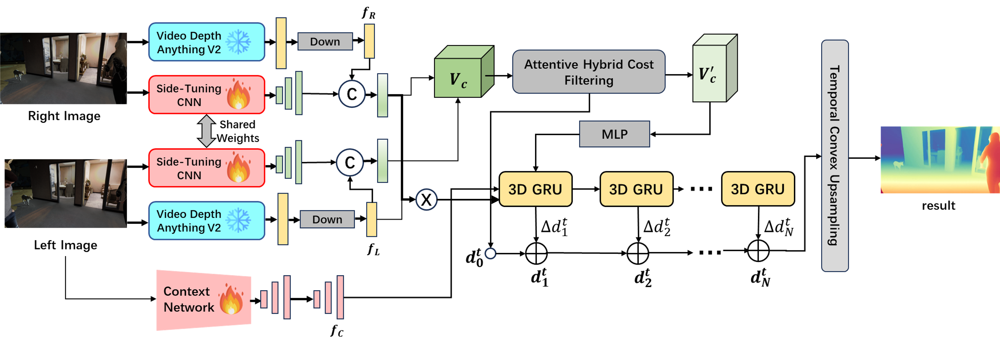

<div align="center">
  <h1>VDE: Video Depth Estimation</h1>

  <a href="#"></a>
  <a href="https://github.com/yixin-zhou/3DV_Video_Depth_Estimation_2025"></a>
  <a href="https://bazziprincess.github.io/3DV_Video_Depth_Estimation_2025/"></a>
  <a href="https://docs.google.com/presentation/d/e/2PACX-1vSpqnjFj72oaubtUzlmMZMxKtOtmZ8zasNSsMiVIkfq71dh14kQmlivHQIKifhmGQ/pub?start=false&loop=false&delayms=3000"></a>

  <br><br>
  <strong>Qinrui Deng, Tong Su, Hepeng Fan, Yixin Zhou</strong><br>
  <em>ETH Zurich</em>
</div>

---

## Overview

**VDE** is a video-oriented stereo depth estimation model designed for temporally consistent and scale-aware depth prediction. Unlike monocular methods, our model leverages stereo frames and temporal priors to produce **robust, zero-shot depth maps** with strong spatiotemporal coherence.

<p align="center">
  
</p>

---


## Quick Start

###  Setup

```bash
git clone https://github.com/yixin-zhou/3DV_Video_Depth_Estimation_2025.git
cd 3DV_Video_Depth_Estimation_2025
conda create -n vde python=3.8
conda activate vde
pip install -r requirements.txt
```

###  Training

```bash
bash Train_our_model.sh
```

### To resume training:

```bash
bash resume_training_from_best.sh
```

### Inference

```bash
python train_with_dynamic_replica.py
```
